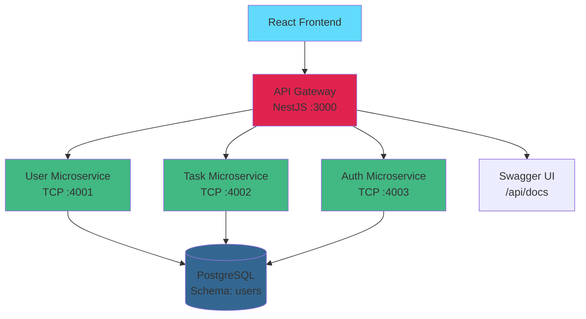

# 🚀 Task Management System

> Task management system built with microservices architecture, API Gateway, and modern frontend.

[](https://github.com/whoyoshome/task-management/actions)
[](https://github.com/whoyoshome/task-management)
[](https://github.com/whoyoshome/task-management)
[](https://www.typescriptlang.org/)
[](https://nestjs.com/)

## 📋 Table of Contents

- [Features](#-features)
- [Tech Stack](#-tech-stack)
- [Architecture](#-architecture)
- [Quick Start](#-quick-start)
- [Project Structure](#-project-structure)
- [Testing](#-testing)
- [API Documentation](#-api-documentation)
- [Deployment](#-deployment)
- [Contributing](#-contributing)

## ✨ Features

- 🏗️ **Microservices Architecture**: Separation of concerns with independent services
- 🔐 **JWT Authentication**: Access and refresh tokens with robust security
- 📊 **API Gateway**: Single entry point with routing and validation
- 🗄️ **Multi-Schema Database**: PostgreSQL with separate schemas per service
- 📝 **OpenAPI/Swagger**: Interactive documentation and automatic TypeScript type generation
- 🧪 **Comprehensive Testing**: Unit tests and E2E tests with high coverage
- 🐳 **Docker Compose**: Fully containerized infrastructure
- 🎨 **Modern Frontend**: React 19 + Vite + TailwindCSS
- 🔄 **CI/CD**: GitHub Actions for automated tests and builds
- 📦 **Monorepo**: Nx workspace for efficient management of multiple applications

## 🛠️ Tech Stack

### Backend
- **Framework**: NestJS 11.1
- **Microservices**: TCP-based communication
- **Database**: PostgreSQL with TypeORM
- **Authentication**: JWT (Passport.js)
- **Validation**: class-validator, class-transformer
- **Documentation**: Swagger/OpenAPI
- **Logging**: Winston
- **Testing**: Jest, Supertest

### Frontend
- **Framework**: React 19
- **Build Tool**: Vite 6
- **Routing**: React Router 7
- **Styling**: TailwindCSS
- **Animations**: Framer Motion

### DevOps & Tools
- **Monorepo**: Nx 21.1
- **Containerization**: Docker & Docker Compose
- **CI/CD**: GitHub Actions
- **Type Safety**: TypeScript 5.7
- **Linting**: ESLint
- **Code Generation**: openapi-typescript

## 🏛️ Architecture



### Main Components

1. **API Gateway** (`apps/api-gateway`)
   - Single entry point for all requests
   - Authentication and authorization
   - Routing to microservices
   - Request validation
   - Swagger documentation

2. **User Microservice** (`apps/user-microservice`)
   - User management
   - Profile CRUD operations
   - Schema: `users`

3. **Task Microservice** (`apps/task-microservice`)
   - Task and project management
   - Boards, sprints, labels
   - Schema: `tasks`

4. **Auth Microservice** (`apps/auth-microservice`)
   - Authentication and authorization
   - JWT token generation
   - Refresh tokens
   - Schema: `auths`

5. **Client App** (`apps/client-app`)
   - React frontend
   - Modern user interface
   - API Gateway consumption

## 🚀 Quick Start

### Prerequisites

- **Docker Desktop** 4.x+ (includes Docker Compose v2)
- **Node.js** 20+ (optional, for local development)
- **npm** or **yarn**

### Installation with Docker (Recommended)

1. **Clone the repository**
   ```bash
   git clone https://github.com/whoyoshome/task-management.git
   cd task-management
   ```

2. **Configure environment variables**
   ```bash
   cp .env.example .env
   # Edit .env with your values
   ```

3. **Start all services**
   ```bash
   npm run docker:up
   ```

4. **Verify everything is running**
   ```bash
   npm run docker:logs
   ```

### Service URLs

Once started, services will be available at:

| Service | URL | Description |
|---------|-----|-------------|
| Frontend | http://localhost:5173 | React web application |
| API Gateway | http://localhost:3000 | Main REST API |
| Swagger UI | http://localhost:3000/api/docs | Interactive documentation |
| Health Check | http://localhost:3000/api/v1/health | Service status |
| pgAdmin | http://localhost:5050 | Database administration |
| PostgreSQL | localhost:5433 | Direct database access |

**pgAdmin Credentials**: `admin@admin.com` / `admin`  
**PostgreSQL**: `admin` / `654321`

### Local Development (without Docker)

If you prefer to run services locally:

```bash
# 1. Install dependencies
npm install

# 2. Configure local PostgreSQL database
# Make sure PostgreSQL is running and create the database

# 3. Run services (in separate terminals)
npx nx serve api-gateway
npx nx serve user-microservice
npx nx serve task-microservice
npx nx serve auth-microservice
npx nx serve client-app
```

## 📁 Project Structure

```
task-management/
├── apps/
│   ├── api-gateway/          # API Gateway (NestJS)
│   ├── user-microservice/    # User microservice
│   ├── task-microservice/    # Task microservice
│   ├── auth-microservice/    # Authentication microservice
│   └── client-app/           # React frontend
├── libs/
│   ├── shared/               # Shared code
│   │   ├── contracts/        # DTOs and interfaces
│   │   └── api-types/         # Generated OpenAPI types
│   └── utils/                # Shared utilities
├── docker/                   # Docker scripts
├── tools/                    # Utility scripts
├── .github/
│   └── workflows/            # CI/CD
├── docker-compose.yml        # Docker configuration
└── README.md
```

## 🧪 Testing

The project includes comprehensive unit and E2E tests:

### Running Tests

```bash
# Unit tests
npm test

# E2E tests
npm run test:e2e

# Coverage
npm run test:coverage
```

### Test Coverage

- ✅ **138 unit tests** passing
- ✅ **26 E2E tests** passing
- ✅ Code coverage > 80%

### Test Structure

```
apps/api-gateway/
├── src/
│   └── **/*.spec.ts          # Unit tests
└── e2e/
    └── specs/
        ├── auth.e2e-spec.ts
        ├── users.e2e-spec.ts
        ├── tasks.e2e-spec.ts
        └── projects.e2e-spec.ts
```

## 📚 API Documentation

### Swagger UI

Access the interactive documentation at:
```
http://localhost:3000/api/docs
```

### OpenAPI Spec

The JSON spec is available at:
```
http://localhost:3000/api/docs-json
```

### TypeScript Type Generation

TypeScript types are automatically generated from the OpenAPI spec:

```bash
# Regenerate types (requires API Gateway to be running)
npm run openapi:types
```

This generates `libs/shared/api-types/openapi.ts` with all API types.

**Usage in frontend:**
```typescript
import type { components } from '@shared/api-types';

type Task = components['schemas']['TaskResponseDto'];
type CreateTask = components['schemas']['CreateTaskDto'];
```

## 🔧 Environment Variables

Copy `.env.example` to `.env` and configure:

### API Gateway
```env
PORT=3000
API_KEY_MIDDLEWARE=your-secret-api-key
```

### Database
```env
# User Microservice
USER_DB_HOST=postgres
USER_DB_PORT=5432
USER_DB_NAME=task-management
USER_DB_SCHEMA=users
USER_DB_USER=admin
USER_DB_PASSWORD=654321

# Task Microservice
TASK_DB_HOST=postgres
TASK_DB_PORT=5432
TASK_DB_NAME=task-management
TASK_DB_SCHEMA=tasks
TASK_DB_USER=admin
TASK_DB_PASSWORD=654321

# Auth Microservice
AUTH_DB_HOST=postgres
AUTH_DB_PORT=5432
AUTH_DB_NAME=task-management
AUTH_DB_SCHEMA=auths
AUTH_DB_USER=admin
AUTH_DB_PASSWORD=654321
```

### JWT
```env
JWT_SECRET=your-jwt-secret
JWT_EXPIRES_IN=1h
JWT_REFRESH_SECRET=your-refresh-secret
JWT_REFRESH_EXPIRES_IN=7d
```

### Frontend (build-time)
```env
VITE_API_URL=http://localhost:3000/api/v1
VITE_MIDDLEWARE=your-api-key
```

## 🚢 Deployment

### Local Production (Docker)

```bash
npm run docker:up:prod
```

### Migrations

For production, use migrations instead of `synchronize`:

```bash
# Generate migration
npm run taskms:migration:generate

# Apply migrations
npm run taskms:migration:run

# Revert last migration
npm run taskms:migration:revert
```

## 🔒 Security

- **API Key**: `x-api-key` header required on most endpoints
- **JWT Authentication**: Access and refresh tokens
- **CORS**: Configurable via `FRONTEND_API_URL`
- **Helmet**: HTTP headers protection
- **Rate Limiting**: Throttler configured
- **Password Hashing**: bcrypt for passwords

## 🐛 Troubleshooting

### Error: `ERR_CONNECTION_REFUSED`

1. Verify containers are running:
   ```bash
   docker ps
   ```

2. Check logs:
   ```bash
   npm run docker:logs
   ```

3. Check occupied ports (Windows):
   ```bash
   netstat -ano | findstr :3000
   ```

### Database doesn't start with schemas

Delete the volume and restart:
```bash
docker volume rm task-management_pgdata
npm run docker:up
```

## 📝 Available Scripts

| Command | Description |
|---------|-------------|
| `npm run docker:up` | Start all services |
| `npm run docker:down` | Stop all services |
| `npm run docker:logs` | View service logs |
| `npm test` | Run unit tests |
| `npm run test:e2e` | Run E2E tests |
| `npm run test:coverage` | Generate coverage report |
| `npm run openapi:types` | Regenerate TypeScript types |
| `npm run lint` | Run linter |

## 🤝 Contributing

Contributions are welcome! Please:

1. Fork the project
2. Create your feature branch (`git checkout -b feature/AmazingFeature`)
3. Commit your changes (`git commit -m 'Add some AmazingFeature'`)
4. Push to the branch (`git push origin feature/AmazingFeature`)
5. Open a Pull Request

## 📄 License

This project is licensed under the MIT License - see the [LICENSE](LICENSE) file for details.

---
